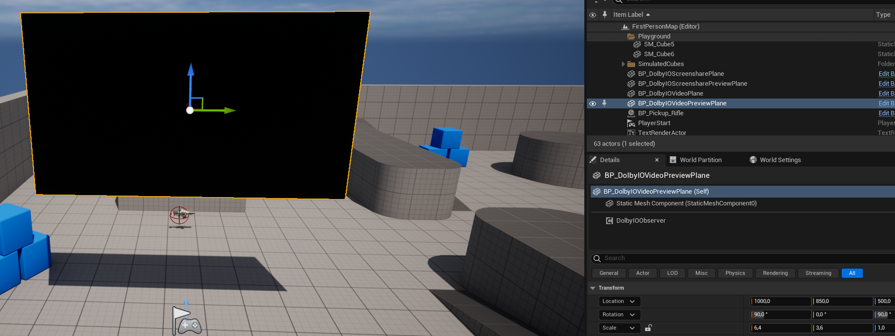

This tutorial explains how to render camera video coming from other participants.

## Prerequisites

Before you start, follow the [common setup](common-setup) tutorial.

## Set up remote video rendering

1. Find `BP_DolbyIOSingleVideoPlane` in the `VideoSamples` folder of the plugin's content in `Content Browser` and drag it onto the scene.

> **_NOTE:_** If you do not see this item, go to the `Content Browser` settings and tick `Show Plugin Content`.

2. Rescale the plane to the desired aspect ratio, for example, [6.4, 3.6, 1.0], and rotate it by [90, 0, 90] to make it face the player start, as in the following example:

If you launch the game now, assuming you successfully connect to a conference with at least one remote participant video enabled, you should see one video feed on the plane.

> **_NOTE:_** This particular implementation allows only one remote video feed. For an example on how to render all video feeds, see [this](#multiple-videos) section.

## How it works

`BP_DolbyIOSingleVideoPlane` is a sample Blueprint with a simple `Event Graph`, which handles [`On Video Track Added`](../blueprints/events#on-video-track-added) and [`On Video Track Removed`](../blueprints/events#on-video-track-removed).

It also contains a generic `Construction Script` to set up the plane's material:

## Multiple videos

1. Find `BP_DolbyIOVideoPlaneSpawner` in the `VideoSamples` folder of the plugin's content in `Content Browser` and drag it onto the scene.

> **_NOTE:_** This sample actor spawns a `BP_DolbyIOGenericVideoPlane` whenever a new video track is added and destroys the plane when its video track is removed. `BP_DolbyIOGenericVideoPlane` is just a plane that contains the same `Construction Script` as above. Its `Event Graph` does nothing by default but contains some nodes in order to be used as a copy-pastable template.

2. `BP_DolbyIOVideoPlaneSpawner` will spawn the first video plane at its location, so place the actor at a location where you want to see the first video. It will also spawn each new video plane a bit to the right (+Y axis) of the previous plane. Therefore, a good idea is to place it above the game template scene so that the planes do not end up hidden inside other meshes.

If you launch the game now, assuming you successfully connect to a conference with more than one remote participant video enabled, you should see multiple video feeds on the spawned planes.

## How the spawner works

`BP_DolbyIOVideoPlaneSpawner` is a sample actor which handles [`On Video Track Added`](../blueprints/events#on-video-track-added) and [`On Video Track Removed`](../blueprints/events#on-video-track-removed) in its `Event Graph`: 

- [`On Video Track Added`](../blueprints/events#on-video-track-added) is handled by spawning a new `BP_DolbyIOGenericVideoPlane`, binding the material of the new plane to the new track ID, and saving the plane in a map variable.

- [`On Video Track Removed`](../blueprints/events#on-video-track-removed) is handled by destroying the plane which is bound to the track and removing it from the map variable.

The implementation of these events is specific to this (rather artificial) use case, but it shows that it is possible to render many videos without much effort.

For a more practical example, consider a case where you have avatars with video planes positioned above the avatars' heads. The planes should have their materials set up as shown in the `Construction Script` above. Assuming you already have a way of managing the avatar actors (their world transform, their lifetime, etc.) and each avatar corresponds to a participant ID, then all you need to do is bind the material from a selected avatar's video plane to the participant's video track.
